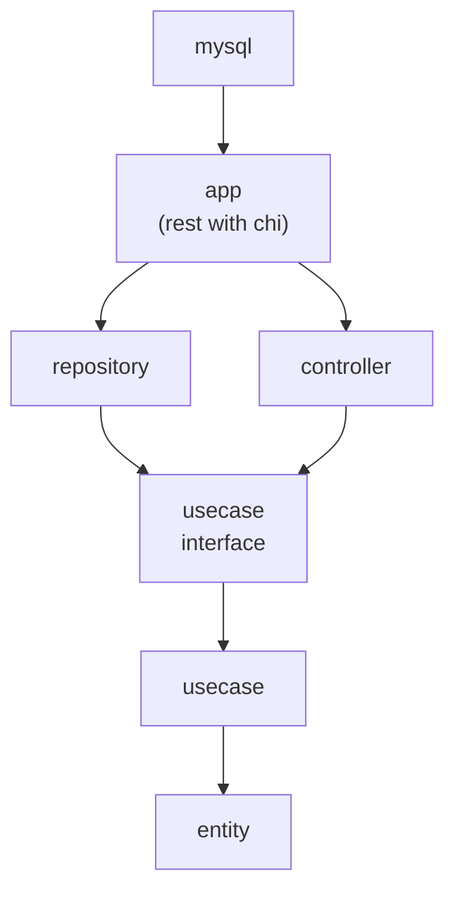

# go-todo
## 概要
> 学習用途
golangを用いて、クリーンアーキテクチャーでREST APIを実装。

[evrone/go-clean-template](https://github.com/evrone/go-clean-template/tree/master)を参考に作成しています。
## 使用したライブラリ
- chi: rest api
- ent: ORM

## Archtecture

